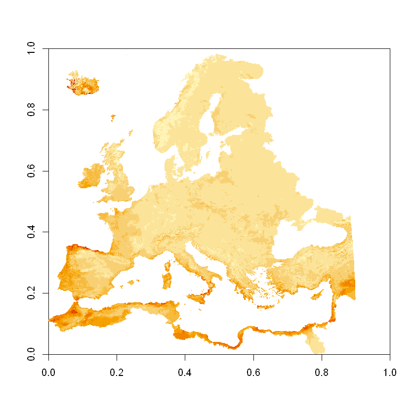

# R NetCDF


```R
library(ncdf4)
```


```R
nc <- ncdf4::nc_open("../../data/OUT_EVAP_monthly_1971.nc")
slice <- ncdf4::ncvar_get(nc, 'OUT_EVAP', start = c(1,1,1), count = c(-1,-1,1))
image(slice)
```





```R

```
